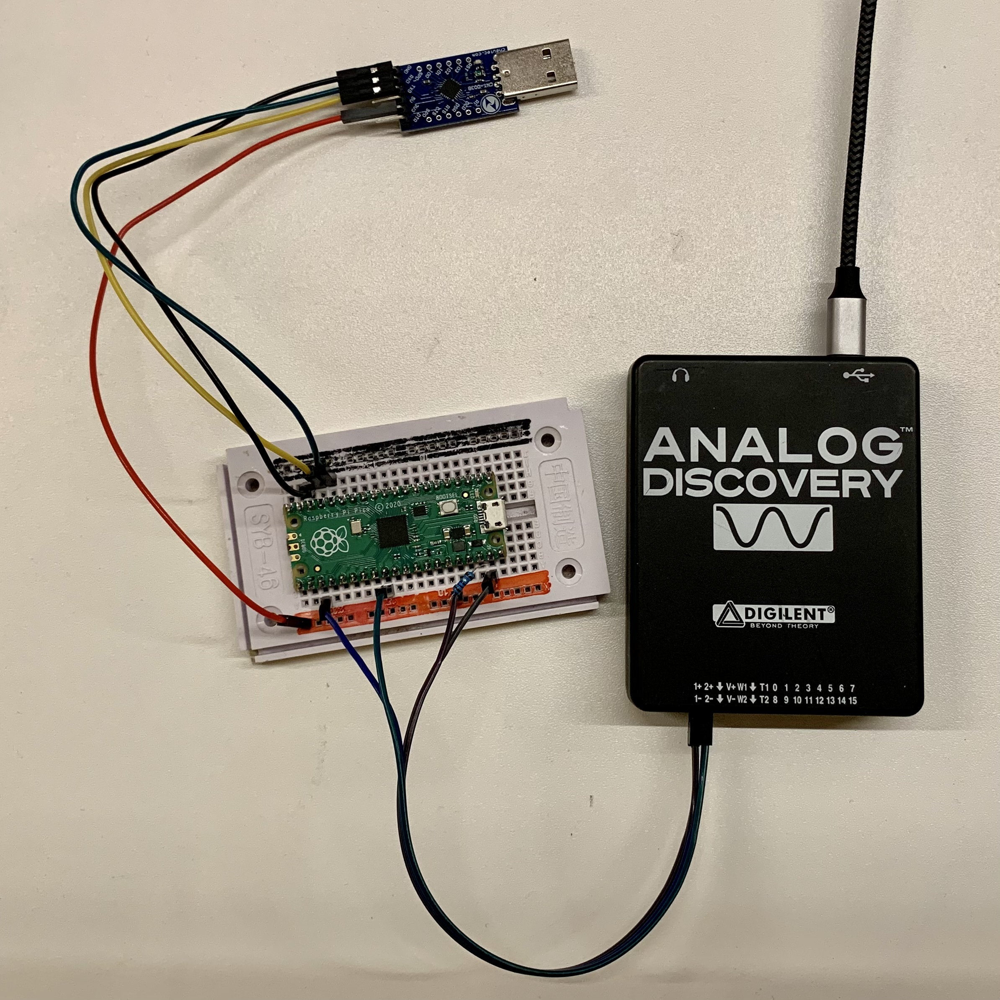

# Analyzing the impact of pruning on CNNs in TinyML applications on energy consumption.
A framework for measuring the energy consumption of a MCU during the execution of pruned TensorFlow-Lite models.

This framework provides Jupyter Notebooks to create LeNet-5 like pruned convolutional neural networks with different compression rates. Furthermore, the framework provides Jupyter Notebooks to convert the models into the required TensorFlow-Lite format. For measuring the energy consumption during execution, the framework provides a Python script to generate current traces. For analyzation purpose, the framework includes scripts to analyze the measured current traces. 

The framework supports the Raspberry Pi Pico which uses an Arm-Cortex M0+ architecture.

## Background
This project was developed in the course of a bachelor thesis. The goal was to answer the following research questions:
- **RQ1:** How does unstructured pruning affect energy consumption?
- **RQ2:** How does structured pruning affect energy consumption?
## Model creation
The framework on one hand, provides Jupyter Notebooks to create pruned models from scratch and on the other hand, it provides pre-trained and pruned models with different compression rates and pruning approaches.
### Pre-trained models
All pre-trained models are located in [Models](https://github.com/widmannthomas/convolutional_neural_network_energy_improvement/tree/main/src/mnist/train/models).
The models are saved as .h5 files and start with a prefix indicating the compression rate.
Section _Create TFL model_ in this [Jupyter Notebook](https://github.com/widmannthomas/convolutional_neural_network_energy_improvement/blob/main/src/mnist/train/train_fashion_mnist_model.ipynb) is used to convert the pre-trained model into a TFL model required by the RPP.

### Pruning
To create pruned models from scratch, the framework provides the following [Jupyter Notebook](https://github.com/widmannthomas/convolutional_neural_network_energy_improvement/blob/main/src/mnist/train/train_fashion_mnist_model.ipynb).

## Execution and energy measurement
For tracing the current consumption of the RPP during execution, the framework provides the following [Python script](https://github.com/widmannthomas/convolutional_neural_network_energy_improvement/tree/main/src/tracing). The script automatically executes the classification on the RPP and traces the current in parallel. After tracing, the script saves the measured data in .csv files.

## Execution
The framework provides a [C++ environment](https://github.com/widmannthomas/convolutional_neural_network_energy_improvement/tree/main/src/mnist) that allows to easily send image data to the Raspberry Pi Pico, do the classification and receive the probabilities.

### Compilation
The project uses _cmake_ as build environment. 

1) create a build directory
```bash
mkdir build
cd build
```

2) run cmake
```bash
cmake ..
```

3. build sub-modules
```bash
cd src/mnist
make
```

### Experiment setup
The following images are showing the experiment setup using the Raspberry Pi Pico.


