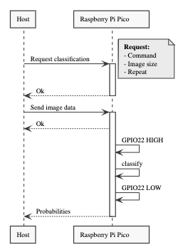

# C++ environment for easy classification of image data on a MCU using UART as communication interface
This part of the framework provides a test environment written in C++ using the TensorFlow-Lite framework. The environment allows an easy communication with the MCU over an UART interface.

## Communication
The communication uses the UART interface and is based on a simple client-server principle. The MCU forms the _server_ and the external device, controlling the experiment forms the _client_ (_Host_).
The following image shows a sequence diagram that describes the communication between the _client_ and the _server_.

## Compilation
The software uses _cmake_ for building and is part of the [main project](https://github.com/widmannthomas/convolutional_neural_network_energy_improvement). Therefore, the main CMakeList.txt has to be used.